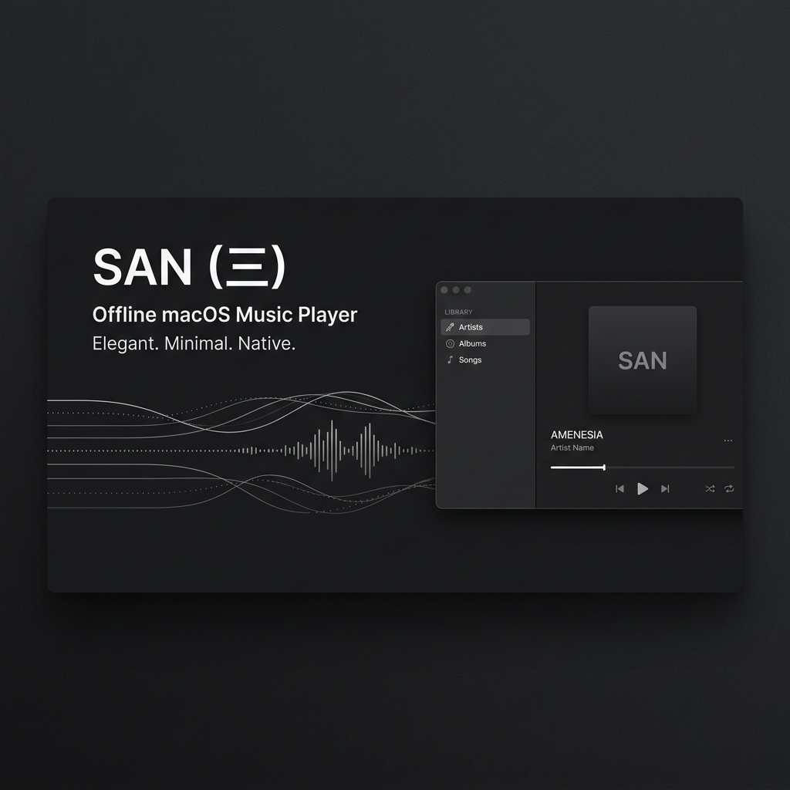
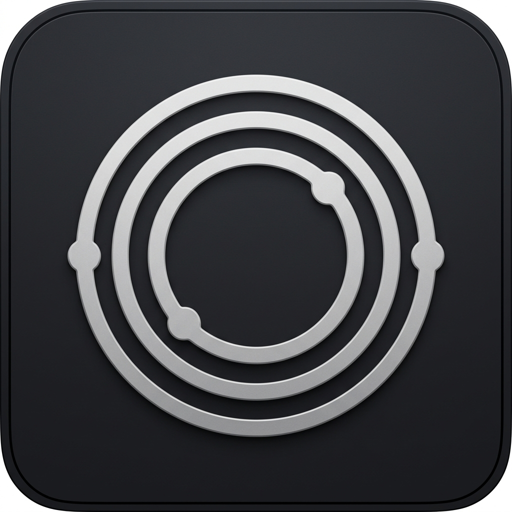

# San (三)

> San is a native, ultra-lightweight, 100% offline macOS local music player built with Swift and SwiftUI.

<p align="center">
  
</p>

> [!WARNING]
> **Development Status**: San is currently under active development and may be unstable. Features, behavior, and build artifacts are subject to change.

---

## Overview

San (Japanese for Three / Harmony) provides a clean, modern interface for listening to local audio files without online accounts, telemetry, or external internet dependencies.

---

## Features

### Audio Spectrum Bar Visualizer Options
- **10 Selectable Spectrum Styles**: Choose how live audio waveform spectrum bars render across the player stage, bottom bar, and status bar popover:
  1. **Vertical Bars**: Classic vertical spectrum bars with smooth level height gradients.
  2. **Continuous Waveform**: Connected frequency curve sine waveform line.
  3. **Pulsing Dots Matrix**: Illuminated dot matrix level meter grid.
  4. **Audio Particles**: Floating glowing particles bouncing to the rhythm.
  5. **Minimal Pill Meters**: Dual horizontal stereo level meters.
  6. **Mirrored Dual Spectrum**: Symmetrical top and bottom dual frequency spectrum bars.
  7. **Cyberpunk Peak Equalizer**: Segmented LED equalizer blocks with peak hold indicators.
  8. **Circular Orbit Ring**: Rotating circular ring with radial level bars.
  9. **Fluid Liquid Wave**: Organic fluid liquid wave filling with beat density.
  10. **Strobe Pulse Meters**: Concentric pulsating beat rings.

### Lyrics Engine & FLAC Vorbis Metadata
- **Interactive Show Lyrics Auto-Scan**: Clicking the Lyrics button or pressing `Cmd + L` executes an instant local search across files and metadata.
- **FLAC Vorbis Comment Extraction**: Reads embedded lyrics from FLAC Vorbis comments (`LYRICS`, `UNSYNCEDLYRICS`, `SYNCEDLYRICS`) and MP3 ID3 frames (`USLT`).
- **Raw Stream Binary Scanner**: Fallback binary reader to parse embedded metadata tags directly from file streams when OS audio APIs omit them.
- **Automatic LRC Synchronization**: Automatically parses timestamp headers (`[MM:SS.xx]`) for real-time synchronized line scrolling.
- **Sidecar File Finder**: Scans local directories for `.lrc` and `.txt` files matching track title or artist combinations.

### Folder Auto-Ranging & Smart Metadata Scanning
- **Automatic Library Integration**: Importing or opening a folder automatically merges all unique tracks into the central library, populating the Artists Page and Albums Page instantly.
- **Smart Folder Hierarchy Metadata Parsing**:
  - **Album Auto-Detection**: Fallback to parent directory name if ID3 album tag is missing.
  - **Artist Auto-Detection**: Fallback to grandparent directory name or `"Artist - Song Title.mp3"` filename format if ID3 artist tag is missing.

### Artist & Library Views
- **Dedicated Artists Page**: Automatically groups tracks by artist with artist profile banners, total album counts, and song totals.
- **Auto-Detected Albums**: Inspecting an artist page auto-detects and categorizes all albums belonging to that specific artist.
- **Play Artist Collection**: One-click action to play all tracks by an artist.

### Artwork Presentation & Motion Options
- **7 Selectable Motion Options**: Custom artwork presentations in Settings (Fluid Spring, Vinyl Record Spin, Wave Spectrum Ring, Floating Glass Card, Ambient Aura Glow, Gentle Ease, Snappy Fast).

### Audio Engine & Playback Controls
- **Crossfade Transitions**: Configurable overlap transition durations (Off, 1s, 2s, 3s, 5s) between tracks.
- **Pre-Buffered Gapless Playback**: Pre-loads next track buffers for zero-gap playback transitions.
- **5-Band Parametric Equalizer**: Custom audio processing with presets (Flat, Bass Boost, Treble Boost, Vocal, Electronic).
- **Sleep Timer Smart Fade-Out**: Linearly fades out the audio volume over the last 60 seconds of the timer for a cozy, smooth transition to silence.
- **Play Count & History Tracking**: Automatically increments track play counts and tracks last-played dates.
- **Variable Playback Speed**: Control speed from 0.5x to 2.0x.
- **Stereo Balance Control**: Adjust left/right audio channel balance.

### Library & Smart Playlists
- **Collapsible Playlist Folders**: Group playlists inside collapsible folders in the sidebar with right-click menus to add, rename, delete, and move playlists.
- **Track Tagging & Filtering**: Assign tags (e.g. `#chill`, `#focus`, `#uplifting`) in the Track Inspector view. View tag badges inline on track rows, and filter the active library view instantly using tag pills.
- **Playlist Export (.m3u / .m3u8)**: Export any custom playlist, favorites, or smart collection to standard `#EXTM3U` and UTF-8 `#EXTM3U8` playlist files via native macOS save dialogs.
- **USB Drive / DAP Direct Sync**: Copy playlists and underlying audio files directly to connected USB flash drives or Digital Audio Players (DAPs) with relative `.m3u8` playlist generation and real-time copy progress indicator.
- **Smart Playlists**: Auto-generated dynamic views for Recently Added, Most Played (Top 25), and Recently Played tracks.
- **Sortable Column Headers**: Clickable column headers to sort library by Title, Artist, Album, Genre, Play Count, or Duration.
- **Genre & Release Year**: Metadata parsing and display across track rows and the Now Playing card.
- **Remove Tracks**: Context menu option to remove tracks from library and playlists.
- **Empty State Views**: Clear guidance and drag-and-drop landing states when collections are empty.
- **Scroll to Playing**: Instant jump button to highlight the active track in large libraries.

### Interface & Customization
- **Waifu3 App Logo Icon**: Official `waifu3` anime mascot app icon (`AppIcon.icns`) for macOS Dock, Finder, and installer bundle.
- **Slice of Life Anime Theme**: Full-window lo-fi background artwork (`waifu2.png`) with dynamic radial accent glows and subtle floating music sparkles.
- **Collapsible Glassmorphic Sidebar**: Translucent floating glass card (`NSVisualEffectView`) with 16pt rounded corners, crystal clear background pass-through, and `sidebar.left` collapse toggle button (Cmd+S).
- **Floating Glass Player Bar**: Translucent glass player control card with symmetrical 10pt gap padding from sidebar.
- **Resizable Sidebar**: Drag-to-resize sidebar width (160pt to 280pt) with persisted dimensions.
- **Dynamic Album Artwork Color Extraction**: Samples dominant vibrant accent colors from playing album artwork in real time.
- **Appearance Modes**: Dark Mode, Pitch Black Mode (OLED), and Light Mode.
- **Window State Persistence**: Automatically restores exact window size and position on relaunch.
- **macOS Integration**: Menu bar popover HUD, Media key support, Now Playing Control Center integration, and Dock icon progress badge.

---

## Tech Stack

- **Language**: Swift 5.9
- **Framework**: SwiftUI + AppKit
- **Audio Core**: AVFoundation (AVAudioPlayer, AVURLAsset, CMAudioFormatDescription)
- **Control Center Integration**: MediaPlayer (MPRemoteCommandCenter, MPNowPlayingInfoCenter)

---

## Building from Source

```bash
./build.sh
```

The build script generates:
- Application binary: `dist/San.app`
- Installer package: `dist/San.dmg`

---

A project by Hariom Sharnam
